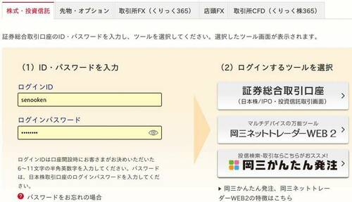
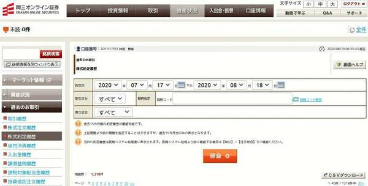
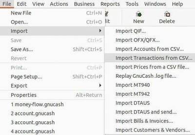
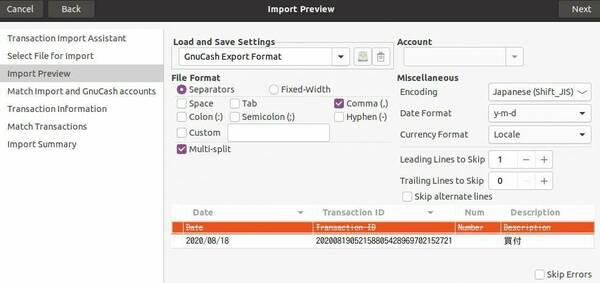
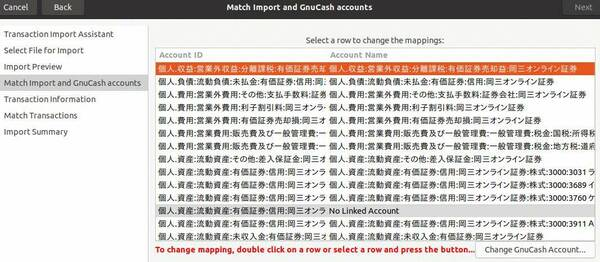
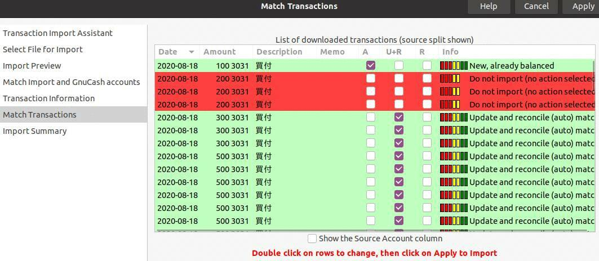
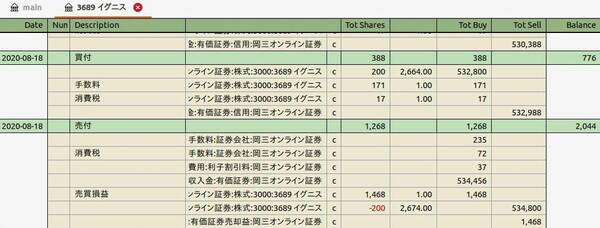
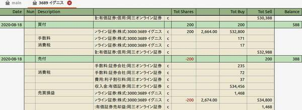

# gnucash-import-stock

gnucash-import-stockは証券口座の取引明細のGnuCashへの取り込みツールだ。

現在 (v1.0.0) は「[岡三オンライン証券](https://www.okasan-online.co.jp)」の信用買と信用返済のみ対応している。

## 依存関係
Python3で作成しているのでPython3が必要となる。

Ubuntu 20.04のGnuCash 3.8で動作を確認している。

## 使用方法
### 明細のダウンロード
岡三オンライン証券の[証券総合取引口座にログイン(https://www.okasan-online.co.jp/login/jp/)する。

[資産状況]>[過去のお取引] の [CSVダウンロード] から以下の2のCSVファイルをダウンロードする。

- 株式約定履歴
- 信用決済履歴

最後の精算金額や源泉徴収税の確認のために，オプションで譲渡益税履歴もダウンロードする。

### 変換ツールの実行
ファイル名は何でもいいので，これらをgnucash-import-stock.pyと同じ階層に配置する。

その後，gnucash-import-stock.pyを実行する。以下の2ファイルが生成される。

- list.csv: 取り込み確認用一覧データ
- import.csv: GnuCashへの取り込みデータ

### GnuCashへのインポート
import.csvをGnuCashで取り込む。

[File]>[Import]>[Import Transaction from CSV...] を選ぶ。

[Select File for Import] で [import.csv] を選んで [Next] を選ぶ。

[Import Preview] で以下を選んで [Next] を選ぶ。

- Load and Save Settings: GnuCash Export Format
- Encoding: Japanese (Shift_JIS)

[Mach Import and GnuCash accounts] で [import.csv] の [Account ID] に対して取り込み先の [Accout Name] を割り当てる。[No Linked Account] と表示されているところをダブルクリックして，取り込み先の勘定科目を選ぶ。

Account IDはソースコード内で決め打ちで入力しているため，気に入らなければ自分で修正する。

全て選び終わったら [Next] を選ぶ。

[Match Transactions] で全ての取引に対して [A] の欄を☑して [Apply] を選ぶ。

### インポート結果の修正
最後にインポートした取引を修正する。

購入時の手数料や売買損益の仕訳に有価証券の勘定科目を使っている。

インポートデータでは，数量 (Tot Shares) と 値段 (Prices) を指定する必要がある。

これらの勘定科目では，金額だけ記録したいので数量と値段を0にしたいのだが，それができなかった。しかたなく，数量にダミーの値を入れているので，これらに0を手作業で入力して，実際の数量の整合性を取る。

例えば，取り込んだ取引は以下のようになっている。

これを以下のように数量と値段を削除する。

最後に，ダウンロードしておいた譲渡益税履歴を確認して精算金額に必要に応じて源泉徴収税を入力して完成させる。

## TODO
- dic1などの処理の効率化
- 信用売への対応
- 現物売への対応
- 文字エンコーディングの自動判定
- GnuCah Python Bindingを用いた手数料と売買損益の正確な入力
- 他の証券会社への対応

## 帰属
- 作者: 妹尾 賢 (SENOO, Ken)
- ライセンス: CC0
